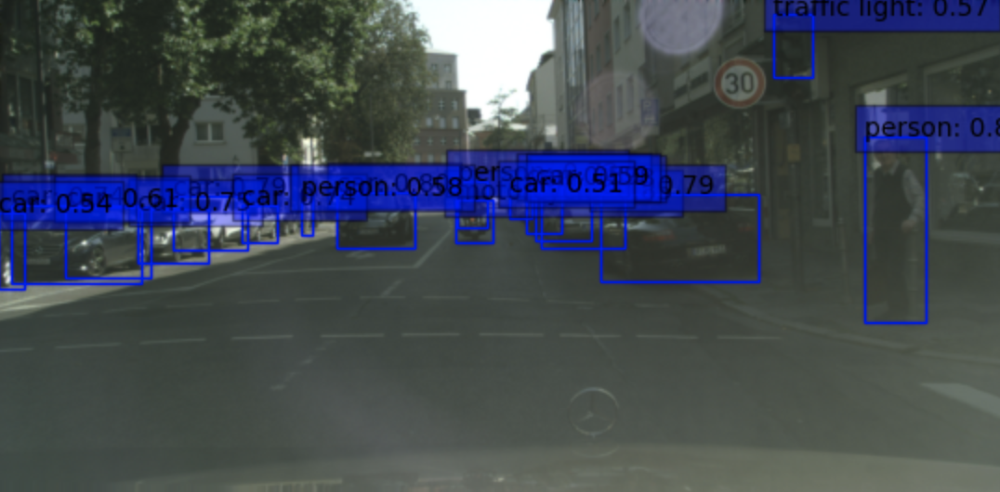
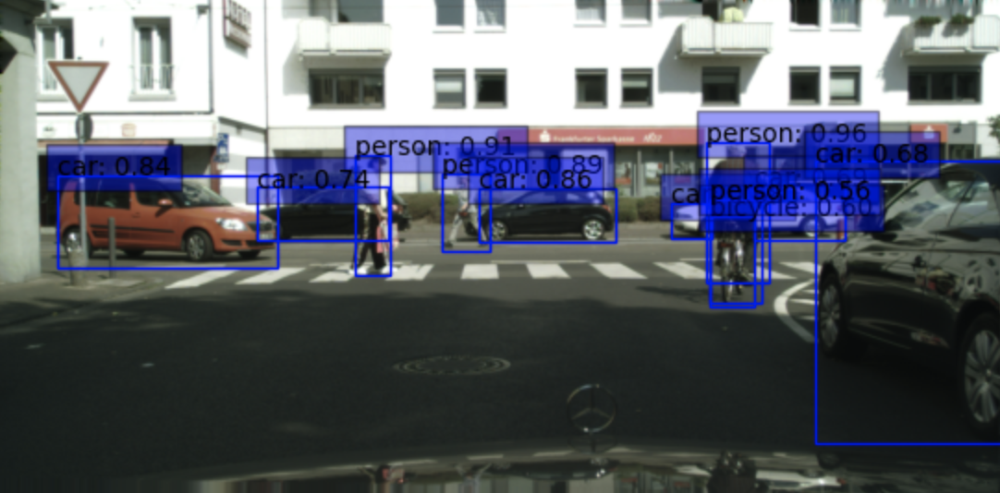

# 2D_Object_Detection_Gr48
Use of Retinanet for cityscapes - Project DLAV 2023

## Folder Structure
Download the Cityscapes Dataset and organize the files in the following structure. Create an empty `annotations` directory. The conversion_seg_to_bbox has to contain the following (the Cityscape dataset gtFine and leftImg8bit can be obtain online by downloading a zip):
```

data/
└── cityscapes
    ├── annotations
    ├── gtFine
    │   ├── test
    │   ├── train
    │   └── val
    └── leftImg8bit
        ├── test
        ├── train
        └── val
main.py
inspect_coco.py
requirements1.txt
```
## Installation of the requirements for the data segmentation conversion to box
```
pip install -r conv/requirements1.txt 
```


## Run the bbox on the Cityscapes
To run the conversion execute the following
```
!python conv/main.py --dataset cityscapes --datadir conv/data/cityscapes --outdir conv/data/cityscapes/annotations
```

In order to run the visualization of the Cityscapes dataset with boxes you may run
```
python conv/vizualize2.py
```
## Input 1

## Output 1


## Installation of the requirements for the model
```
pip install -r requirements2.txt 
```

## Run the Retinanet model
To run the model execute
```
python main_model.py
```

In order to run the visualization of Cityscapes prediction please launch run the command:
```
python vizualization.py
```
note: Due to computation issues the weights that are used have been computed on the initial dateset

## Output 2
  
